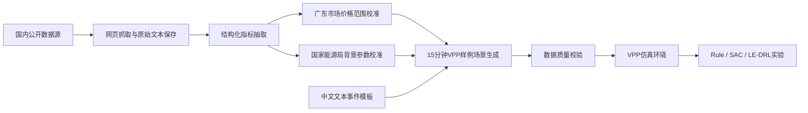
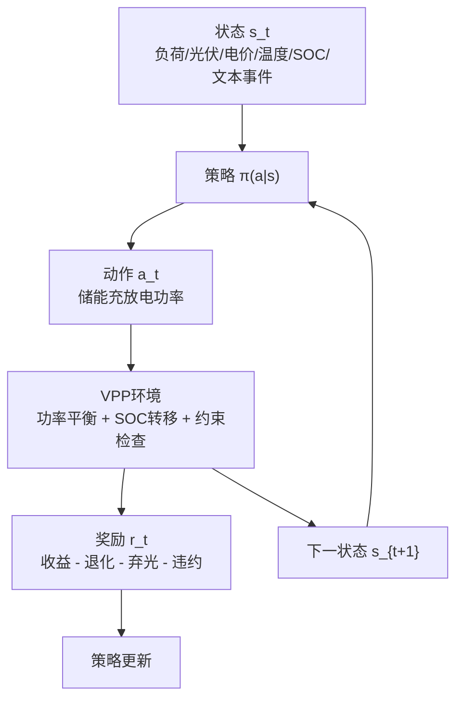
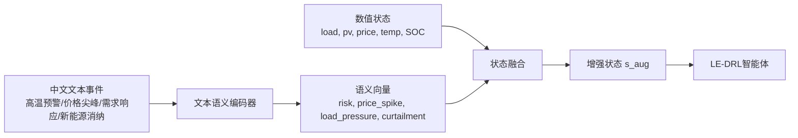

# 第3章图示草稿

## 图3-1 数据处理流程

```mermaid
flowchart LR
  A["国内公开数据源"] --> B["网页抓取与原始文本保存"]
  B --> C["结构化指标抽取"]
  C --> D["广东市场价格范围校准"]
  C --> E["国家能源局背景参数校准"]
  D --> F["15分钟VPP样例场景生成"]
  E --> F
  G["中文文本事件模板"] --> F
  F --> H["数据质量校验"]
  H --> I["VPP仿真环境"]
  I --> J["Rule / SAC / LE-DRL实验"]
```

## 图3-2 虚拟电厂环境交互流程

```mermaid
flowchart TD
  S["状态 s_t<br/>负荷/光伏/电价/温度/SOC/文本事件"] --> P["策略 π(a|s)"]
  P --> A["动作 a_t<br/>储能充放电功率"]
  A --> E["VPP环境<br/>功率平衡 + SOC转移 + 约束检查"]
  E --> R["奖励 r_t<br/>收益 - 退化 - 弃光 - 违约"]
  E --> N["下一状态 s_{t+1}"]
  R --> U["策略更新"]
  N --> P
```

## 图3-3 语义增强状态构建

```mermaid
flowchart LR
  N["数值状态<br/>load, pv, price, temp, SOC"] --> F["状态融合"]
  T["中文文本事件<br/>高温预警/价格尖峰/需求响应/新能源消纳"] --> E["文本语义编码器"]
  E --> V["语义向量<br/>risk, price_spike, load_pressure, curtailment"]
  V --> F
  F --> A["增强状态 s_aug"]
  A --> M["LE-DRL智能体"]
```

