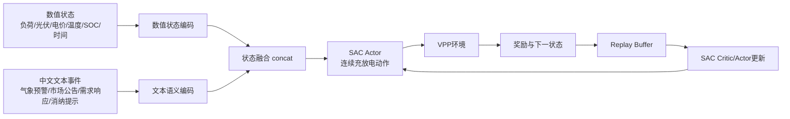
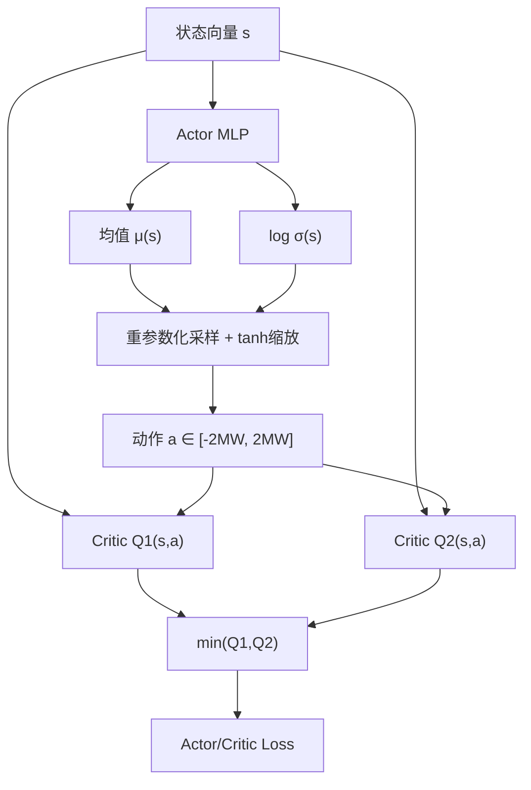

# 第4章算法与图示

## 算法4-1 SAC-Numeric训练流程

```text
输入：训练数据 D，VPP环境 Env，数值状态编码器 Enc_num，SAC智能体
初始化：Actor πθ，Critic Qφ1, Qφ2，目标网络 Qφ'1, Qφ'2，经验池 B
for episode = 1 ... N do
    重置环境，获得初始状态 s
    while episode 未结束 do
        x = Enc_num(s)
        根据 πθ(a|x) 采样动作 a
        在环境中执行 a，获得 r, s'
        x' = Enc_num(s')
        将 (x, a, r, x', done) 存入 B
        从 B 采样小批量数据
        更新 Critic：最小化 Bellman 误差
        更新 Actor：最大化 Q 值与策略熵
        软更新目标网络
        s = s'
    end while
end for
输出：训练后的 SAC-Numeric 策略
```

## 算法4-2 LE-DRL-SAC训练流程

```text
输入：训练数据 D，VPP环境 Env，数值状态编码器 Enc_num，文本语义编码器 Enc_text，SAC智能体
初始化：Actor πθ，Critic Qφ1, Qφ2，目标网络 Qφ'1, Qφ'2，经验池 B
for episode = 1 ... N do
    重置环境，获得初始状态 s 和文本事件 T
    while episode 未结束 do
        x_num = Enc_num(s)
        x_sem = Enc_text(T)
        x_aug = concat(x_num, x_sem)
        根据 πθ(a|x_aug) 采样动作 a
        在环境中执行 a，获得 r, s', T'
        x'_aug = concat(Enc_num(s'), Enc_text(T'))
        将 (x_aug, a, r, x'_aug, done) 存入 B
        从 B 采样小批量数据
        更新 Critic：最小化包含熵项的目标 Q 误差
        更新 Actor：最大化软 Q 目标
        软更新目标网络
        s = s', T = T'
    end while
end for
输出：训练后的 LE-DRL-SAC 策略
```

## 图4-1 LE-DRL-SAC方法框架



## 图4-2 SAC网络结构



