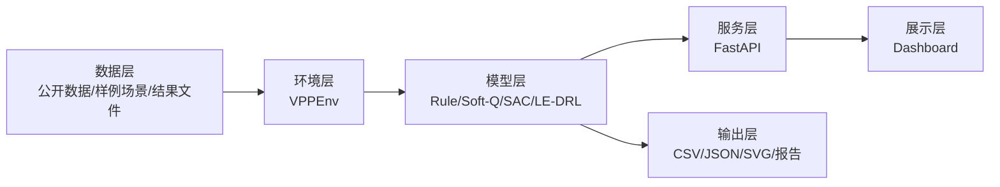
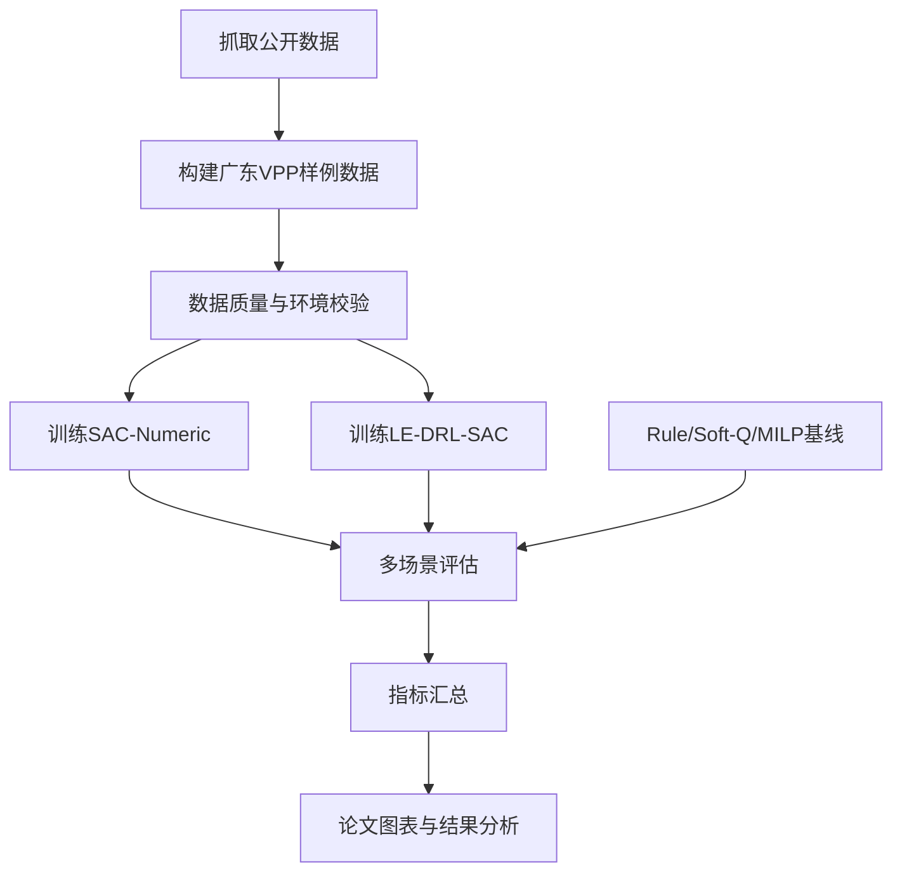
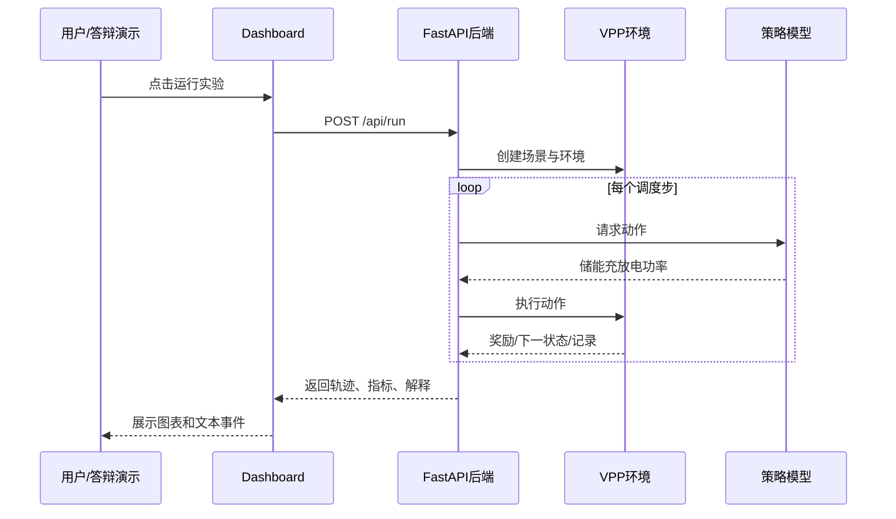

# 第5章系统与实验图示

## 图5-1 系统总体架构

```mermaid
flowchart LR
  D["数据层<br/>公开数据/样例场景/结果文件"] --> E["环境层<br/>VPPEnv"]
  E --> M["模型层<br/>Rule/Soft-Q/SAC/LE-DRL"]
  M --> S["服务层<br/>FastAPI"]
  S --> W["展示层<br/>Dashboard"]
  M --> O["输出层<br/>CSV/JSON/SVG/报告"]
```

## 图5-2 实验流程

```mermaid
flowchart TD
  A["抓取公开数据"] --> B["构建广东VPP样例数据"]
  B --> C["数据质量与环境校验"]
  C --> D["训练SAC-Numeric"]
  C --> E["训练LE-DRL-SAC"]
  D --> F["多场景评估"]
  E --> F
  G["Rule/Soft-Q/MILP基线"] --> F
  F --> H["指标汇总"]
  H --> I["论文图表与结果分析"]
```

## 图5-3 前后端交互流程

```mermaid
sequenceDiagram
  participant User as 用户/答辩演示
  participant Web as Dashboard
  participant API as FastAPI后端
  participant Env as VPP环境
  participant Model as 策略模型

  User->>Web: 点击运行实验
  Web->>API: POST /api/run
  API->>Env: 创建场景与环境
  loop 每个调度步
    API->>Model: 请求动作
    Model-->>API: 储能充放电功率
    API->>Env: 执行动作
    Env-->>API: 奖励/下一状态/记录
  end
  API-->>Web: 返回轨迹、指标、解释
  Web-->>User: 展示图表和文本事件
```

